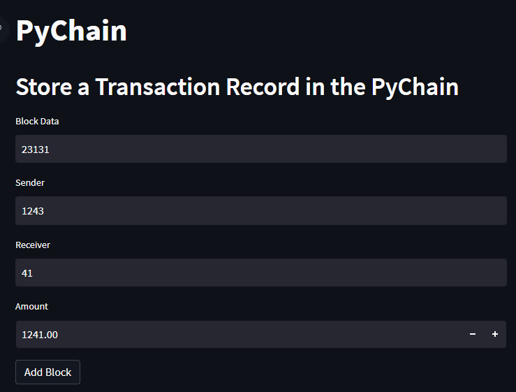
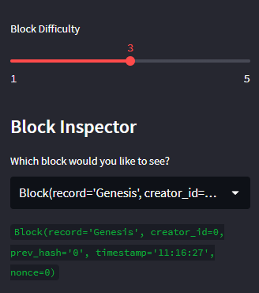
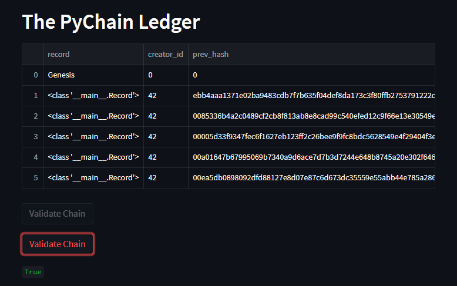

# Blockchain Ledger System
As a fintech engineer at one of the five largest banks in the world, I was asked to act as the lead developer on their decentralized finance team. We were tasked to build a blockchain-based ledger system, complete with a user-friendly web interface. This ledger will allow partner banks to conduct financial transactions (that is, to transfer money between senders and receivers) and to verify the integrity of the data in the ledger.

# Steps
1. Create a Record Data Class

2. Modify the Existing Block Data Class to Store Record Data

3. Add Relevant User Inputs to the Streamlit Interface

4. Test the PyChain Ledger by Storing Records

# Transaction Data:

# Block Difficulty:

# Validation:

## Contributors
> email: henrydate1@gmail.com |
> [GitHub](https://github.com/henrydate) |
> [LinkedIn](https://www.linkedin.com/in/henry-date-9356351a4/)

---
